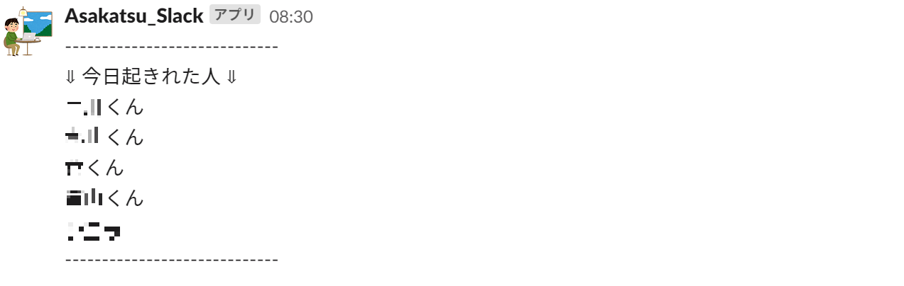

# Asakatsu-Slack
朝活Slackに朝の訪れを伝える。

 

### Architecture
---

 

### How to use
---
①指定した時刻にSlackBotが朝の訪れを伝える。

②グループのメンバーは30分以内に起きて返信をする。

③ちゃんと朝起きて返信できたメンバーを数えて投稿される。

④週末にはメンバーがそれぞれ一週間で何日起きれたか投稿される。

 

### License
---
MIT
